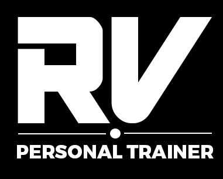

# RVPT WEBSITE
This is a Personal Training website designed to help provide information to people new to the fitness industry but more so, help generate leads (potential clients). 

Ideally most users of this website are perhaps considering getting themselves a personal trainer. They will find this website useful, they would have hopefully learnt at least one new thing about workouts or nutrition, they would have learnt more about myself and my PT business, but ultimately, they end up completing the enquiry form at the end, in the hopes that they end up becoming a client of mine.
 
## TABLE OF CONTENTS
| Section |
| --- |
| [Project Logo, title and desciption](#rvpt-website) |
| [Features](#features) |
| [UX / UI](#uxui-section) |
| [Testing](#testing) |
| [Unfixed Bugs](#unfixed-bugs) |
| [Deployment](#deployment) |
| [Citation of sources](#citation-of-sources) |
| [Future Features](#future-features) |

## FEATURES
### The color scheme of the website as a whole:
- A black background with white text. This is to the match the color scheme of the logo design.
- Thick, curved white borders around the navigation and footer to show clear separation from them to the main content of the page.
- Colourful images with a dark background. This allows the images to stand out more than they would, had they of had a white background.
- Green text when hovering over links. This is a darker, more subtle and calmer shade of green which complements the vibrant photos, but more so represent the color of grass from parks. This is because most sessions are predominantly delivered in local parks.

### The structure of the website: 
- As all good websites have, each page will have a navigation menu at the top of the page and a footer at the bottom of the page. This repetition is said to make user experiences better as users like it when a website has a common theme/layout, so that it then becomes quick and easy to learn and navigate through.
- The first page is naturally the home page. Where users learn about the business. It will have a large image relating to the business, the about me section, then followed by client testimonials. As testimonials are a major factor in gaining new clients, it is essential that they be on the home page.
- The next two pages is then all about workouts then nutrition. As nutrition will partly depend on the workout style you opt for, people should first know what they want to train, so that when reading the nutrition, they know what they need to prioritise. 
- Lastly, the enquire page, where if users have enjoyed the content and want to take it further by starting personal training sessions, they are able to complete an enquiry form. From here, the trainer can then be in contact with the person as they would have received their contact info from the form they filled out.

### The content provided in the website:
- The Home page is deliberately designed and layed out in this manner, so that the first thing seen is the trainer, the business name and a brief overview of the business. It is supposed to reassure users that this is a legitimate business in which they can trust in. Furthermore, putting a face to the business is one of the first steps in helping users trust the business.  
- It is followed by testimonials to help further the users trust into the business and to provide them with previous client experiences. Users can then read this to gain a better understanding of what they can expect to receive should they sign up to PT.
- On the workouts page, weightlifting must be first for two reasons. Firstly, I specialise in strength training, so it naturally makes sense to talk about this first. Secondly, there is a lot of misconception regarding weight lifting, so before we go any further, I feel as though this should be clarified.  
- The cardio section will then go next due to its popularity and importance it has in my business.
- It is followed by stretching as it's the least important in my business and least used in my sale techniques. Also, we tend to do stretching at the end of a workout, so this workout page nicely mirrors my workouts with clients (weights first, then some cardio, followed by some stretching at the end of a workout).
- We then move onto the Nutritions page where we talk about the 3 main macronutrients which are the main sources of fuel our body needs. A typical person will need 50% carbs, 30% protein, 20% fats, hence why I presented them in this order. As people struggle with nutrition the most, I have chosen to add additional support regarding nutrition by providing a link to the eatwell guide as well as a daily food planner.
- Lastly, the enquire page, summarising why you should train with me, followed by a form to complete if interested in personal training. 
- At the bottom of each page there will be a footer. The footer is being used as a sales point leading users to the enquire page and my social media accounts, both designed to help bring in new clients.
- Each photo is deliberately selected to match with the topic we are talking about, with all text written next to or below the photo (depending on the device). I aim to create clear division in topics through the use of photos, the topic title and spacing. This structure stays consistent throughout to keep the user experience good.
- As this website has many pictures with lots of colors, I wanted to keep the text simple and clear, which is why I opted for a lack of font-awesome icons. Plus I feel as though the font-awesome icons would have just been of the same thing as the image, which I feel there is no need to repeat.

## UX/UI SECTION  

### Site Goals:

### Design Choices:

### User Stories:

### Wireframes:

## TESTING

[Testing can be found here](/testing.md)

## DEPLOYMENT

## CITATION OF SOURCES

### Media credit:  

### Content credit:  

#### Workout Info:
 
#### Nutrition:

#### Links used to help structure README.md file:

#### Links used to help for CSS styling:

#### Links used to help write HTML code:  

## FUTURE FEATURES  