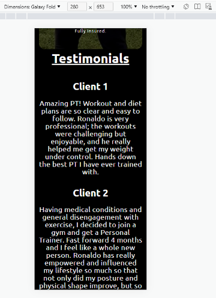

# TESTING

## Responsiveness test
All pages and the content within them have been designed with a mobile-first approach and made to be fully responsive on all devices.

- The website should shrink/expand accordingly with the layout changing ever so slightly depending on the device screen width.
- All links should work regardless of the device being used.
- All Content must be readable.
- Images should maintain its quality regardless of screen size.
- The form should be able to be filled out no matter what device is being used.

Tests have been done through the use of DevTools on the browser.

| Device screen width | Extra Small <576px | Small ≥576px | Medium ≥768px | Large ≥992px | Extra Large ≥1200px |
| --- | --- | --- | --- | --- | --- |
| Header / Navigation Responsiveness | Good | Good | Good | Good | Good |
| All Images Responsiveness | Good | Good | Good | Good | Good |
| All Text Responsiveness | Good | Good | Good | Good | Good |
| Form Responsiveness | Good | Good | Good | Good | Good |
| Footer Responsiveness | Good | Good | Good | Good | Good |

I Have tested every device available in which the DevTools allow. Below are screenshots of some devices tested on.

### Galaxy fold - this was the thinnest mobile device (XS Device):
| Page | Screenshots | Page | Screenshots |
| --- | --- | --- | --- |
| Home page |  | Home Page |  |
| Home page |  | Workout page |  |  
| Nutrition page | | Enquire page |  |

### iPhone 6 - this is another mobile device with slightly different dimensions and has the device frame included (XS Device):
| Page | Screenshots | Page | Screenshots | Page | Screenshots |
| --- | --- | --- | --- | --- | --- |
| Home page |  | Home page |  | Home page |  |
| Workout page |  | Nutrition page |  | Enquire page |  |

### iPad Mini - Small tablet device (M Device):
| Page | Screenshots | Page | Screenshots | Page | Screenshots |
| --- | --- | --- | --- | --- | --- |
| Home page |  | Home page |  | Workout page |  |
| Nutrition page |  | Enquire page |  | |

### iPad Pro - Large tablet device (L Device):
| Page | Screenshots | Page | Screenshots |
| --- | --- | --- | --- |
| Home page |  | Workout page |  |
| Nutrition page |  | Enquire page |  |

### Nest Hub Max - (XL Device):
| Page | Screenshots | Page | Screenshots | Page | Screenshots |
| --- | --- | --- | --- | --- | --- |
| Home page |  | Home page |  | Workout page |  |
| Nutrition page |  | Enquire page |  | |

### Custom Device dimensions (roughly the size of a 27inch TV) - Extra Large Desktop/Small TV (XL Device):
| Page | Screenshots | Page | Screenshots |
| --- | --- | --- | --- |
| Home page |  | Workout page |  |
| Nutrition page |  | Enquire page |  |

## Browser compatibility test
The website's appearance should be the same, regardless of the browser being used.
The website's responsiveness should be the same, regardless of the browser being used.

|   | Chrome | Edge | Safari | 
| --- | --- | --- | --- |
| Intended appearance? | Good | Good | Good |
| Intended responsiveness | Good | Good | Good | 

## Bugs test
No bugs found in final deployment.

## Lighthouse test
### Mobile devices:
| Page | Result | Page | Result |
| --- | --- | --- | --- |
| Home page |  | Workout page |  |
| Nutrition page |  | Enquire page |  |

### Desktop devices:
| Page | Result | Page | Result |
| --- | --- | --- | --- |
| Home page |  | Workout page |  |
| Nutrition page |  | Enquire page |  |

## Code validation test (HTML)
HTML validator used: [https://validator.w3.org/]

### Initial Test - Home page
| Test result screenshot | Action needed |
| --- | --- |
|  | No action needed |

### Initial Test - Workout page
| Test result screenshot | Action needed |
| --- | --- |
|  | No action needed |

### Initial Test - Nutrition page
| Test result screenshot | Action needed |
| --- | --- |
|  | No action needed |

### Initial Test - Enquire page
| Test result screenshot | Action needed |
| --- | --- |
|  | Remove section element around enquire photo. Remove the h5 element from inside the textarea element. Create a new id to style the text. Remove the type attribute from textarea element. |

### Second Test - Enquire page
| Test result screenshot | Action needed |
| --- | --- |
|  | No action needed |

## Code validation test (CSS)
CSS validator used: [https://jigsaw.w3.org/css-validator/]

### Initial Test
| Test result screenshot | Action needed |
| --- | --- |
|  | Remove p word-spacing declaration. Remove textarea border declaration. |

### Second Test
| Test result screenshot | Action needed |
| --- | --- |
|  | No action needed |

## User stroies test
| Expect | Action | Result |
| --- | --- | --- |
| As a website user I want to press on the business logo in the navigation section and be taken to the home page | I pressed on the logo in the navigation section at the top of the website | I was taken to the home page - Success |
| As a website user I want to press on 'home' in the navigation and be taken to the home page | I pressed on 'home' in the navigation | I was taken to the home page of the website - Success |
| As a website user I want to press 'Workout Info' and be taken to the the workout information page | I pressed on 'Workout Info' in the navigation | I was taken to the workout information page - Success |
| As a website user I want to press 'Nutrition' and be taken to the nutrition page | I pressed on 'Nutrition' in the navigation | I was taken to the nutrition page - Success |
| As a website user I want to press 'Enquire Now' and be taken to the enquire page | I pressed on 'Enquire Now' in the navigation | I was taken to the enquire page - Success |
| As a website user I want to press on the instagram icon and be taken to the business' instagram account | I pressed on the instagram icon in the footer | I was taken to the business' instagram account - Success |
| As a website user I want to press on the facebook icon and be taken to the business' facebook account | I pressed on the facebook icon in the footer | I was taken to the business' instagram account - Success |
| As a website user I want to press 'Enquire Now!' in the footer and be taken to the enquire page | I pressed on 'Enquire Now!' in the footer | I was taken to the enquire page - Success |
| As a website user I want to press on the 'NHS Eatwell Guide' link in the nutritions page and be redirected to the NHS Eatwell Guide page on the NHS website | I pressed on 'NHS Eatwell Guide' | I was redirected to the NHS Eatwell Guide page on the NHS website - Success |
| As a website user I want to press on the 'download or print' link in the nutritions page and have a printable/downloadable food planner document | I pressed on 'download or print' | I was redirected to a separate pdf document where I was able to download or print the daily food planner doc. - Success |
| As a website user I want to press on 'submit' in the form section of the enquire now page and my form be submitted | I filled out the form then pressed 'submit' | My form was submitted - Success |
| As a person new to fitness I want to learn new information about workouts | I pressed on 'Workout Info' where I was then able to scroll down through the page reading the information provided on workouts | I was easily able to navigate myself to the workout information page, where I was able to scroll down the page and clearly read the information provided on workouts - Success |
| As a person new to fitness I want to learn new information about food and dieting to help me understand what I should be eating | I pressed on 'Nutrition' where I was then able to scroll down the page reading the information provided on nutrition | I was easily able to navigate myself to the nutrition page, where I was able to scroll down the page and clearly read the information provided on nutrtion - Success |
| As a person new to fitness I want to trust in the business and information provided by seeing positive reviews/testimonials from previous clients | On the home page, first thing I see if an overview of the business with the trainer's qualifications and experience. I then scrolled down where I was able to read some testimonials from previous clients | Clear easy layout where I was able to naviagte myself to the client testimonials - Success |
| As a person new to fitness I want to learn new information about workouts to help me when in the gym | I navigate to the workouts page and read the information provided | There is a lot of information provided and I believe that I now have a better understanding of what to do when working out in the gym - Success |
| As a person new to fitness I want to learn new information about nutrition to help me make better food choices | I navigate to the nutrition page and read the information provided | There is a lot of information provided and I believe that I now have a better understanding of what I should be eating and in what ratio - Success |
| As a person wanting a PT, I want to learn about the Personal Trainer to find out what type of training they specialise in | I navigate to the home page, read the about me text written over the image | I can read what the trainer specialises in - Success |
| As a person wanting a PT, I want to know if the PT knows his stuff and can bring me value if I decide to train with him | I navigate through the website and see all of the information provided | I believe that the trainer can help me with all my goals - Success |
| As a person wanting a PT, I want to see client testimonials to see how previous and current clients have found their training experiences | On the home page, I scrolled down to the client testimonials section to read the client reviews | I was able to easily navigate myself to the testimonials section where I was able to read multiple reviews from previous/current clients, helping me come to a final decision - Success |

## Features test
| Feature | Expect | Action | Result |
| --- | --- | --- | --- |
| Business logo navigation button | When clicked, the home page will open | Clicked on the business logo in the navigation | Home page opened when clicked - Success |
| 'Home' navigation button | When clicked, the home page will open | Clicked 'Home' in the navigation | Home page opened when clicked - Success |
| 'Workout Info' navigation button | When clicked, the workout info page will open | Clicked 'Workout Info' in the navigation | Workout page opened when clicked - Success |
| 'Nutrition' navigation button | When clicked, the nutrition page will open | Clicked 'Nutrition' in the navigation | Nutrition page opened when clicked - Success |
| 'Enquire Now' navigation button | When clicked, the enquire page will open | Clicked 'Enquire Now' in the navigation | Enquire page opened when clicked - Success |
| 'Enquire Now!' footer button | When clicked, the enquire page will open | Clicked 'Enquire Now!' in the footer | Enquire page opened when clicked - Success |
| Facebook link in footer | When clicked, I will be redirected to the business' Facebook account | Clicked on the Facebook icon in the footer section | Was redirected to the facebook page of the business - Success |
| Instagram link in footer | When clicked, I will be redirected to the business' Instagram account | Clicked on the Instagram icon in the footer section | Was redirected to the Instagram page of the business - Success |
| NHS Eatwell Guide link | Press 'NHS Eatwell Guide' and be taken to the NHS website regarding this | Pressed on the NHS Eatwell Guide link in the nutrition page | Was taken to the NHS Eatwell Guide section on the NHS website - Success |
| Daily food planner link | Press 'download or print' and be taken to the downloadable/printable document regarding this | Pressed on the download or print link in the nutritions page above the Eatwell Guide | Was taken to the relevant food planner document where I was able to download and/or print this pdf doc. - Success |
| Form Submit Button | The form submits when the 'submit' button is clicked | Clicked 'submit form' in the form section | The form submitted when the submit button was clicked - Success |
| Hovering over links in the nav, footer and nutrition 'food help' section | When the cursor hovers over a link, the text will change color into green. When the cursor is removed, the text will return to its original white color | I hovered over the links in the nav, footer and nutrition sections | The links changed color into green, then returned to its original white color once the cursor was removed - Success |
| Hovering over the 'submit' button in the form section | When the cursor hovers over the submit button, the text will change color into white with the background green color changing into a darker shade of green. When the cursor is removed, the text and background will return to its original colors | I hovered over the submit button in the form section | The text and background changed colors accordingly, then returned to its original colors once the cursor was removed - Success|
